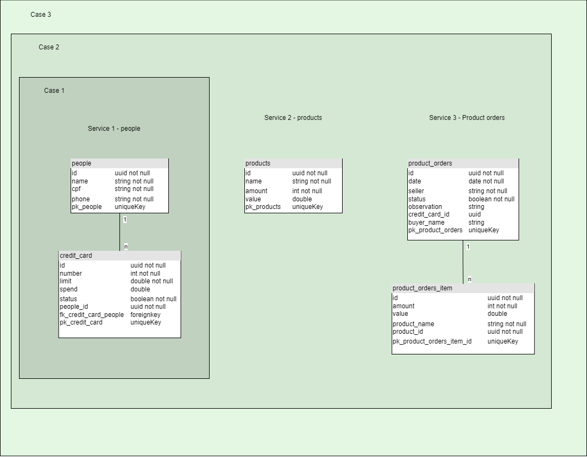

# Avaliação técnica Certsys
## Obrigatório

### Github

- Criar um fork a partir do repositório certsys-test.
- Criar uma branch a partir da develop para criação dos códigos.
- Realizar o pull request para a develop e excluir branch antiga após o merge.
- A branch avaliada será a main. Após conclusão realizar merge entre develop e main.

### Considerações sobre o projeto

- A escolha do banco de dados fica a critério do canditado.
- Necessário utilizar o docker-compose para subir os ambientes.
- É necessário ter autenticação nas rotas.
- O candidato fica livre para escolha de padrões de projeto e tecnologias.
- Testes serão um diferencial.
- É necessário realizar a documentação do projeto.

**Observação: Caso a vaga exija alguma tecnologia ou padrões específico será solicitado para o candidato.**

***
## Descrição
A ideia do desafio é desenvolver um sistema de pedido, abaixo será listado alguns casos para seguir como base, porém fica a critério do canditado acrescentar mais features ou melhorias.

## Caso 1
- Autenticação.
- Criar um projeto monolitíco.
- Criar um crud para as entidades credit_card e people.
- Não pode cadastrar mais de uma pessoa com o mesmo cpf.

## Caso 2
- Autenticação.
- Criar um projeto monolitíco.
- Criar um crud para as entidades credit_card e people.
- Não pode cadastrar mais de uma pessoa com o mesmo cpf.
- Criar um crud para products.
- Criar um pedido.
- Não pode criar um pedido com o estoque zerado.
## Caso 3
- Autenticação.
- Criar um projeto microservices.
- Criar um crud para as entidades credit_card e people.
- Não pode cadastrar mais de uma pessoa com o mesmo cpf.
- Criar um crud para products.
- Não pode criar um pedido com o estoque zerado.
- Criar um pedido.
- Garantir que não seja realizado o pedido caso não tenha saldo no cartão de crédito (Consultar da variavel spend).
- Garantir a sincronia de dados caso ocorra uma alteração no nome da pessoa.

**Observação: Toda melhoria será levado em consideração ao realizar a análise do projeto.**